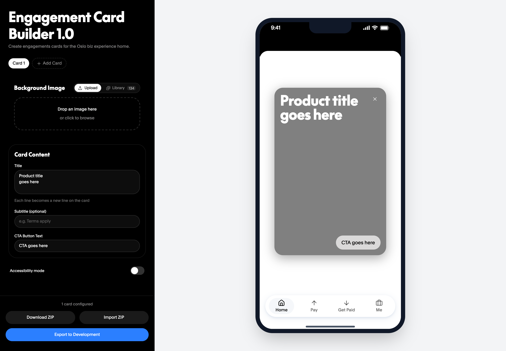
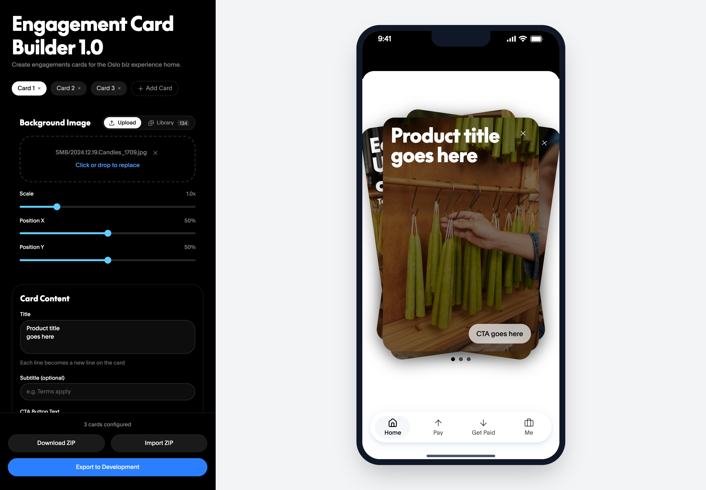
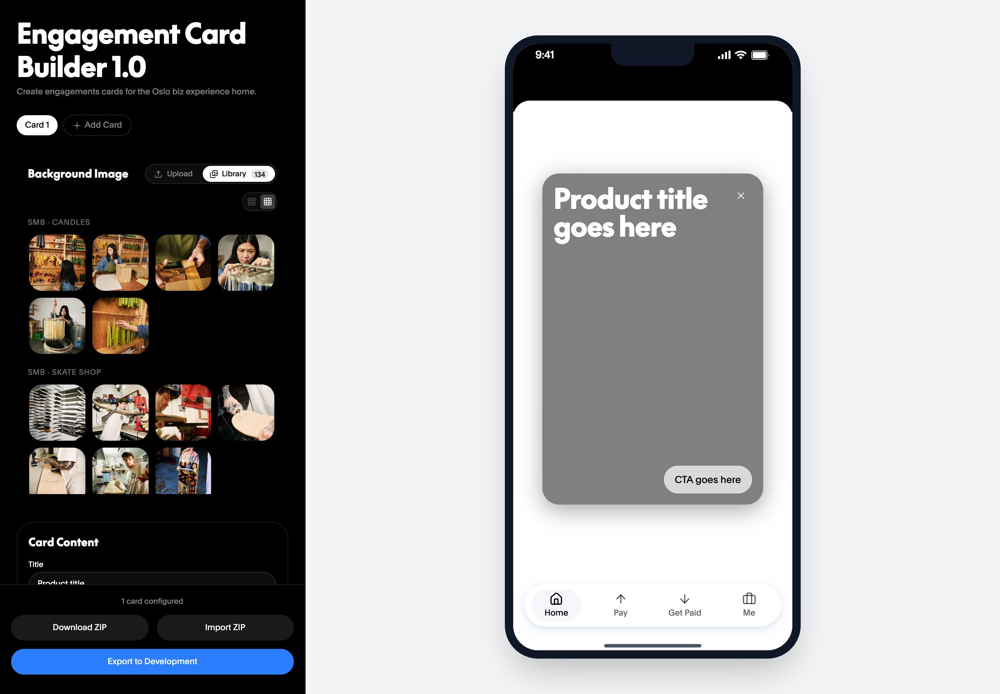
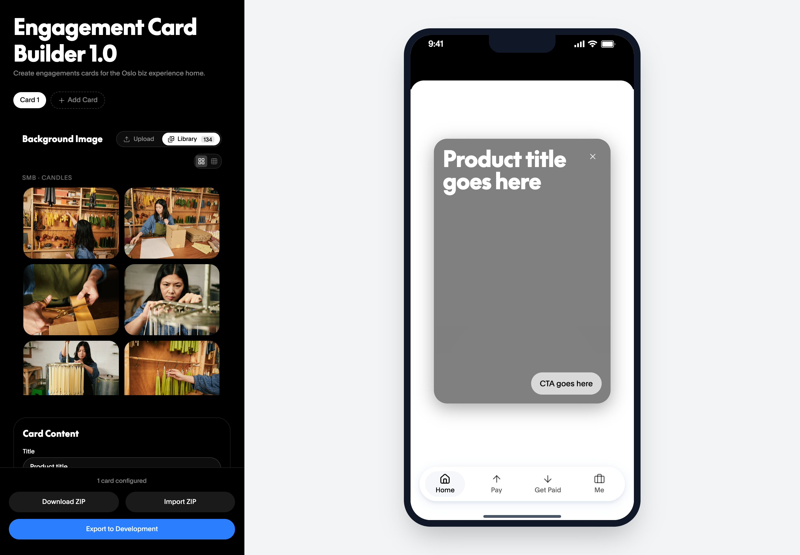
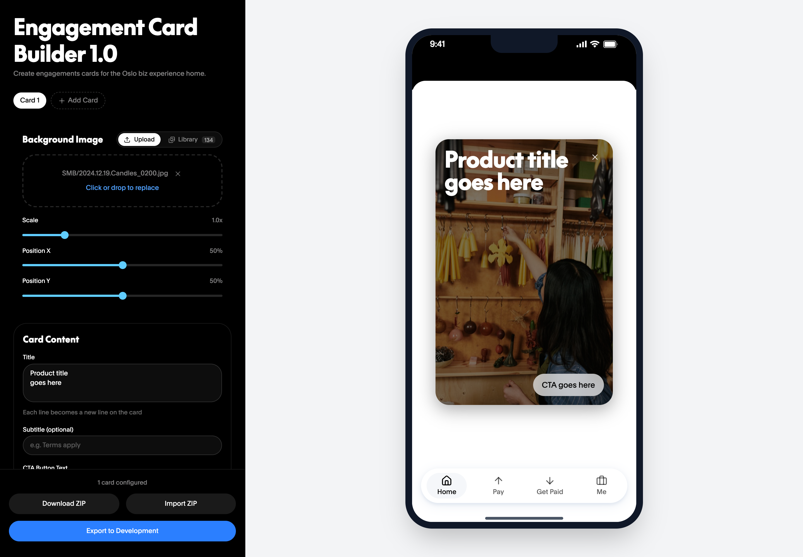
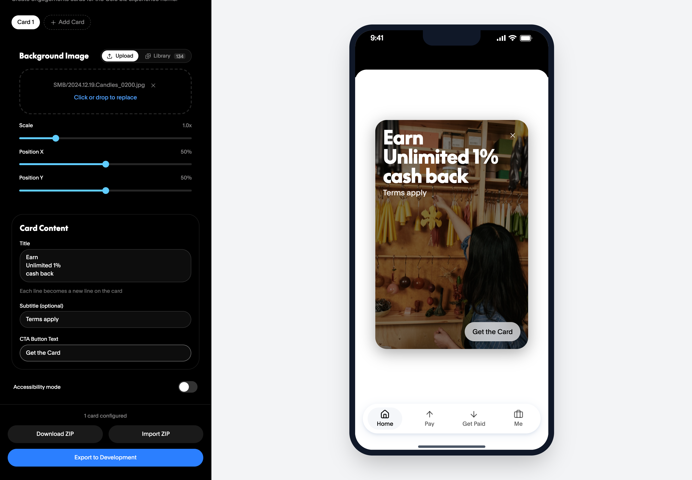
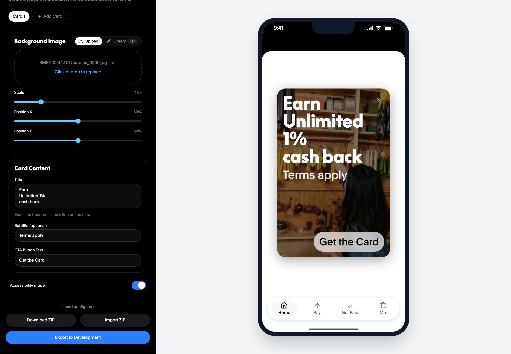

# Engagement Card Builder

A self-serve tool for designing the engagement cards that appear in the **collection deck** on the Oslo business experience home screen.

> **Audience:** Teams working on the Oslo platform, particularly the business experience — product, content design, experience design, engineering, marketing, partnerships, and legal.



---

## About

Engagement cards are the promotional surfaces on the Oslo business home. Today, getting one shipped usually means a Figma mock, a content thread, a legal review, and an engineering hand-off where the final spec doesn't always match what was approved.

The Engagement Card Builder is an internal tool that brings that whole flow into one place. You can drop in a hero image (or pick from a curated PayPal photography library), write the title, subtitle, and CTA, adjust the crop, and watch the card render live inside an Oslo home preview that mirrors production. When the card is ready, you share a draft `.zip` for review by Oslo home owners, content design, experience design, and legal — and once everyone is aligned, one click produces an engineering-ready bundle (1x/2x/3x renders, JSON metadata, and a reference preview).

It's a work in progress, but the core flow is usable today.

---

## What it is

A browser-based card editor with three big jobs:

1. **Design** — A faithful, side-by-side preview of the Oslo home so what you build is what ships.
2. **Review** — A portable `.zip` "draft" format you can hand to design, content, and legal partners without screenshots or Figma URLs.
3. **Hand-off** — A one-click export that produces production-grade assets at @1x, @2x, and @3x densities plus structured JSON metadata for engineers.

It is **not** a CMS. Cards do not go live by being created here — they always go through the review workflow below before reaching production.

## Who it's for

Anyone on the Oslo platform — particularly the business experience — can pick this up. Common roles and what they tend to use it for:


| Role                         | What you'll do here                                                       |
| ---------------------------- | ------------------------------------------------------------------------- |
| **Product**                  | Draft cards, run experiments, shepherd through review, hand off to dev    |
| **Content Designer**         | Review/edit copy directly in the tool, leave feedback on the live preview |
| **Experience Designer**      | Validate composition, image crop, accessibility behavior                  |
| **Legal & Compliance**       | Approve final copy + visuals against the rendered preview                 |
| **Engineer**                 | Receive the dev export bundle, drop assets into the Oslo repo             |
| **Marketing / Partnerships** | Pitch concepts, supply imagery, see exactly how a card will look          |


---

## Review & approval workflow

Every card goes through this path before it ships. The builder produces the artifact you need at each step.

```
   ┌────────┐    ┌─────────────┐    ┌──────────────────┐    ┌───────┐    ┌──────┐
   │ Draft  │ -> │ Oslo Home   │ -> │ Content & XD     │ -> │ Legal │ -> │ Dev  │
   │ in EC  │    │ Owner sign- │    │ design feedback  │    │ sign- │    │ hand-│
   │Builder │    │ off         │    │                  │    │ off   │    │ off  │
   └────────┘    └─────────────┘    └──────────────────┘    └───────┘    └──────┘
        ↓               ↓                    ↓                  ↓            ↓
   Auto-saved     Download ZIP →      Same ZIP →           Same ZIP →   Export to
   in browser     share for review    inline copy edits    final review Development
```

### 1. Draft

Open the builder, create one or more card variants, iterate. Drafts auto-save to your browser locally — closing the tab won't lose work.

### 2. Oslo Home owner review

Use **Download ZIP** to produce a portable draft (`oslo-biz-engage-cards-{timestamp}.zip`). Send to the Oslo Home owner for prioritization and slot approval. They can drop it back into their own Engagement Card Builder via **Import ZIP** to inspect every detail.

### 3. Content + Experience design review

Same `.zip` flow. Designers can:

- Re-import the draft in their own browser to see the live preview
- Edit copy directly in the tool (titles, subtitles, CTA)
- Toggle **Accessibility mode** to verify the card scales properly for users with larger text settings
- Send back an updated `.zip` with their changes

### 4. Legal & compliance

Hand legal the **same** `.zip` (or just the rendered preview screenshots if they prefer). Because the preview matches production exactly, what they approve is what ships — no surprises.

### 5. Engineering hand-off

Once all parties have signed off, click **Export to Development**. This produces a separate bundle (`oslo-biz-engage-cards-dev-{timestamp}.zip`) that contains everything an engineer needs:

- `images/` — Cropped, density-correct PNG/JPG renders at @1x (318×477), @2x, and @3x
- `previews-reference-only/` — A flattened reference render of each finished card with copy and CTA baked in
- `engagement-cards.json` — Structured metadata: titles, subtitles, CTAs, and a manifest of which image goes with which card

File the bundle as an attachment on the Jira ticket and the engineer can drop it straight into the Oslo repo.

> **Important:** The Download ZIP and Export to Development bundles are different. Download ZIP is for round-tripping drafts between collaborators (it preserves raw, uncropped source images so anyone can keep editing). Export to Development is the final, baked, engineer-ready hand-off.

---

## Quick start

1. **Open the tool.** No install. The latest build is hosted at the Oslo Builder Tools site.
2. **Add a background image.** Either drop a file onto the upload area or click **Library** to pick from the curated PayPal photography library (BDMC 2025, SMB shoots, Tap to Pay, etc.).
3. **Position the image.** Use Scale, Position X, and Position Y sliders to crop. The preview updates live.
4. **Write the copy.** Title (multi-line supported), Subtitle (optional, often used for "Terms apply"), and CTA.
5. **Add more cards.** Click **+ Add Card** to create variants. Tabs at the top let you switch between them. The collection deck preview shows them as a stack — exactly how Oslo home will render them.
6. **Send for review.** Click **Download ZIP** and share with stakeholders.
7. **Hand off to dev.** Once approved, click **Export to Development**.

### Try it with a sample

Want to see what a finished set of cards looks like before building your own? Download this sample and load it via **Import ZIP**:

[**📦 engagement-cards-sample.zip**](docs/samples/engagement-cards-sample.zip) — 3 pre-built cards (BDMC 2025 cash back, Tap to Pay setup, working-capital offer) you can import, edit, and re-export to explore the full flow end-to-end.

---

## Feature reference

### Cards & variants

- **Add Card** — Creates a new card and makes it active. Cards appear as tabs above the editor and as a swipeable stack in the preview.
- **Switch cards** — Click any card tab to edit it. The preview will scroll to that card automatically.
- **Delete card** — Click the `×` on a tab. The last remaining card cannot be deleted.



### Background image

Two ways to add an image:

#### Upload tab

- Drag a file onto the dotted area, or click to browse.
- Accepts any standard image format (JPG, PNG, WebP).
- After upload, the filename is shown with an `×` to remove it and a "click or drop to replace" hint.

#### Library tab

- Browse the curated PayPal photography library, organized by shoot/category (BDMC 2025, SMB · Candles, SMB · Skate Shop, SMB · UK CS, Tap to Pay, etc.).
- **View toggle** in the top-right: 4-per-row compact grid (default) or 2-per-row larger thumbnails.
- Selected image is marked with a blue check.
- A small badge shows total library count next to "Library."


| 4-per-row (default) | 2-per-row |
| --- | --- |
|  |  |


#### Image adjustment

When an image is set, three sliders control the crop:

- **Scale** (0.5×–3×) — Zoom level. 1.0× = the image fills the card edge-to-edge based on aspect ratio.
- **Position X** (0–100%) — Horizontal anchor. 0% = left edge, 100% = right edge.
- **Position Y** (0–100%) — Vertical anchor. 0% = top edge, 100% = bottom edge.

The slider tracks fill in PayPal blue as you drag, and the preview updates in real-time.



### Card content

- **Title** — Multi-line textarea. Each newline becomes a literal new line on the card. The title font is `PayPal Pro Black 40px`.
- **Subtitle** — Optional single-line field. Typically used for legal disclaimers ("Terms apply") or supporting copy.
- **CTA Button Text** — Text for the action button on the card (e.g. "Get the Card", "Get started"). Keep it short — long CTAs will visually crowd the card.



### Accessibility mode

A toggle at the bottom of the editor that simulates large-text accessibility settings on the device. The preview re-renders with subtitle and CTA scaled to ~2× so you can verify the card still composes well for users with larger system text. Always check this before signing off.



### Undo / redo

- `**⌘Z`** — Undo
- `**⌘⇧Z`** — Redo
- Keeps the last 20 changes.
- Slider drags are coalesced (one undo step per drag, not one per movement).

### Auto-save

- Drafts (including images) auto-save to your browser's local storage 500ms after any change.
- Reopening the tool restores your last session.
- Auto-save is local to the browser — if you switch machines or browsers, use **Download ZIP** + **Import ZIP** to move work.

### Export & import


| Button                    | Output                               | Use for                                                          |
| ------------------------- | ------------------------------------ | ---------------------------------------------------------------- |
| **Download ZIP**          | `oslo-biz-engage-cards-{ts}.zip`     | Sharing drafts with reviewers; round-tripping with collaborators |
| **Import ZIP**            | n/a (consumes a ZIP)                 | Loading a draft someone else sent you                            |
| **Export to Development** | `oslo-biz-engage-cards-dev-{ts}.zip` | Final hand-off to engineering                                    |


The Download/Import ZIP format contains the raw source image so editors can keep iterating. The Dev Export bundles flattened, density-correct PNG/JPG renders plus structured JSON for engineers.

---

## Tips & best practices

- **Build variants in parallel.** Teams commonly draft 2–3 variants of the same card so Oslo Home owners can pick the strongest. Use card tabs.
- **Use the photography library.** It's pre-cleared by brand and curated for Oslo SMB stories. Custom uploads add legal/brand review steps.
- **Write the title in 2–3 short lines.** The title font is large and bold; long single lines wrap awkwardly. Pre-break with newlines for control.
- **Always toggle Accessibility mode before review.** A card that looks great at default size can break at +200% type.
- **Keep a draft `.zip` for every approved card.** It's your source of truth for re-export if the dev hand-off ever needs to be regenerated.
- **One ticket per card** for engineering hand-off keeps tracking clean, even if you exported multiple cards in the same `.zip`.

---

## Troubleshooting / FAQ

**My draft disappeared after closing the browser.**
Auto-save is local to the browser profile. Private/incognito windows wipe storage on close. Always **Download ZIP** before closing for important work.

**The dev export looks different from my preview.**
The dev export bakes the image crop and content into a flat render at @1x/@2x/@3x. Tiny pixel differences from sub-pixel rendering are expected — the live preview is the source of truth for design intent.

**Can I use a GIF or video?**
Not yet. Engagement cards are static images in the Oslo home today.

**How do I know if my image is high-enough resolution?**
Cards render at 318×477 logical pixels, but engineering needs @3x → **954×1431** at minimum. The library images are pre-vetted. If you upload your own, aim for ≥1400px on the long edge.

**Who do I talk to for a new shoot or to add images to the library?**
Reach out in the Oslo SMB design channel. New library images need to be added to `public/library/` and registered in `src/imageLibrary.ts` — the design ops team handles this.

**Can two people collaborate on the same card?**
Use the `.zip` round-trip workflow. Real-time multi-user editing isn't supported yet.

---

## For developers

This is a Vite + React + TypeScript app. To run locally:

```bash
npm install
npm run dev
```

Key files:

- `src/ECBuilder.tsx` — App shell, top-level state, export/import handlers
- `src/ECBuilderForm.tsx` — Left pane editor (image, content, sliders)
- `src/ECBuilderPreview.tsx` — Right pane device preview using the Oslo design system
- `src/exportDev.ts` — Engineering export pipeline (canvas rendering at 1x/2x/3x)
- `src/autosave.ts` — IndexedDB-backed local draft persistence
- `src/useUndoHistory.ts` — Undo/redo history with file-blob retention
- `src/imageLibrary.ts` — Curated library manifest (filename, label, category)
- `public/library/` — Source images for the library

To add a new image to the library, drop the file in `public/library/<category>/` and add an entry to `IMAGE_LIBRARY` in `src/imageLibrary.ts`. JPEGs are preferred (smaller); see git history for the optimization commands used (sips for resize/quality, ffmpeg for PNG→JPEG conversion).

### Regenerating documentation screenshots

The screenshots in `docs/images/` are captured by `scripts/screenshot.mjs` against a running dev server. To refresh them after a UI change:

```bash
npm install --no-save puppeteer-core
npm run dev          # in one terminal, serves on http://localhost:5180
node scripts/screenshot.mjs
```

The script clears the IndexedDB draft, drives the UI through the documented states, and writes 7 PNGs into `docs/images/`.